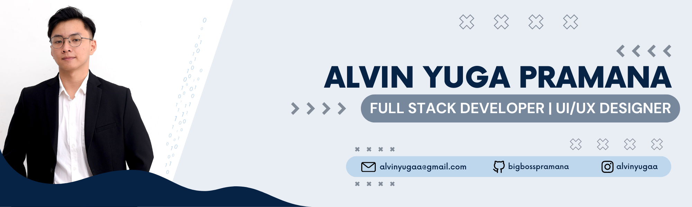

# Hi, I'm Alvin Yuga Pramana 👋 👨‍💻

### About Me 📝

Currently a student at Universitas Ciputra Makassar majoring in Informatics. I am a passionate **Full-stack Developer** and **UI/UX Designer** with a keen eye for creating functional, problem-solving digital products. I enjoy the entire process of App Development, from designing user-centric interfaces to deploying scalable infrastructure.

* 💻 Constantly building web applications and exploring the best practices in software engineering.
* 🎨 Focusing on user perspective to create intuitive and seamless digital experiences.
* ⚙️ Enthusiast in DevOps, container orchestration, and exploring Machine Learning applications.

---

### Technical Skills 💼

**Programming Languages**  

 
  

 
  
 

  

**Frameworks & Technologies**  
 
 
 
  
 
 
 
  

**Design & Tools**   

 
  
 

---

### Projects 🔬

Here's a summary of my key projects, showcasing my journey through software development from UI/UX conceptualization to full-stack application development.

* **PeduliPanti**
  A mobile web application designed to help users find activity partners or "companions". I focused on building complex UI layouts, including custom date pickers and scrollable time selections, ensuring a smooth and functional user experience.
  
  *Key Technologies: React.js, Vite, TypeScript, CSS Modules*
  
  ➡️ [View Repository](#)

* **PilahPilih**
  An innovative marketplace concept aimed at optimizing food supply chains and reducing food waste. The platform connects farmers and fishermen directly to consumers to sell food products that do not meet standard visual criteria but are still perfectly good for consumption.
  
  *Key Technologies: UI/UX Design, Prototyping, Frontend Development*
  
  ➡️ [View Repository](#)

* **Mobile Food Quality Assessment**
  A research and development project applying Machine Learning to assess food quality via mobile devices. The project involves image pre-processing and model benchmarking directly on smartphones.
  
  *Key Technologies: Python, EfficientNet-B0, MobileViT-S, CLAHE*
  
  ➡️ [View Repository](#)
